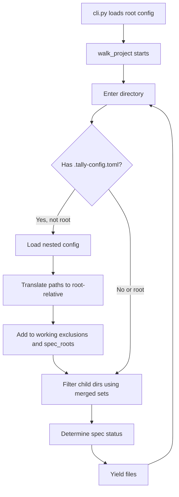

# Nested Config Discovery

## Context

Currently, Tallyman loads a single `.tally-config.toml` (found by walking up from the target directory) and uses it for the entire scan. When a user scans a parent directory containing multiple subprojects that each have their own configs, those nested configs are ignored.

**Design decisions (confirmed):**

- The parent folder still has/creates its own config; nested configs are **additive**
- Top-level config takes **precedence** -- nested configs can only add exclusions/specs, never remove them
- Effectively a **union merge** of all configs encountered during traversal

## Architecture

The change is entirely within the walker. No changes to `cli.py` or `config.py` are needed -- the existing pipeline stays intact, and nested config discovery happens transparently inside `walk_project()`.



## Changes

### 1. `walker.py` -- Core logic

**Import additions** at top of `walker.py`:

```python
from tallyman.config import CONFIG_FILENAME, load_config
```

**At the start of `walk_project()`**, copy `excluded_dirs` to avoid mutating the caller's set:

```python
working_excluded = set(excluded_dirs)
```

Then use `working_excluded` everywhere instead of `excluded_dirs`.

**After computing `rel_dir_str` and before the directory filtering loop**, insert nested config discovery:

```python
# Discover nested config files in subdirectories
if rel_dir_str:
    config_file = dirpath / CONFIG_FILENAME
    if config_file.is_file():
        try:
            nested_config = load_config(config_file)
            for excl in nested_config.excluded_dirs:
                working_excluded.add(f'{rel_dir_str}/{excl}')
            for spec in nested_config.spec_dirs:
                active_spec_roots.add(f'{rel_dir_str}/{spec}')
        except Exception:
            pass  # Skip malformed configs in subdirectories
```

- `rel_dir_str` check skips the root directory (its config is already loaded by `cli.py`)
- Path translation: a nested config at `project1/` with exclusion `vendor` becomes `project1/vendor` relative to root
- `try/except` provides robustness against malformed configs in third-party subprojects
- Both `working_excluded` and `active_spec_roots` are sets, so duplicate additions are harmless

### 2. `test_walker.py` -- Tests

Add a new test class `TestWalkProjectNestedConfigs` with these tests:

- **`test_nested_config_exclusions_applied`** -- A subdirectory with its own config excluding a child dir; that child is not walked
- **`test_nested_config_spec_dirs_applied`** -- A subdirectory with its own config marking a child as specs; docs files there become specs
- **`test_root_config_not_reloaded`** -- Placing a `.tally-config.toml` at root should not cause double-loading (already handled by `cli.py`)
- **`test_top_level_exclusion_preserved`** -- Top-level excludes `project1/vendor`, nested config does not; `vendor` is still excluded (union behavior)
- **`test_deeply_nested_config`** -- Config inside `folder/subfolder/project3/` works correctly
- **`test_union_of_exclusions`** -- Both top-level and nested exclusions apply simultaneously

Tests will use `tmp_path` fixtures and the existing `save_config` helper to create `.tally-config.toml` files in subdirectories.

### 3. `change-log.md` -- Under UNRELEASED

Add an entry describing the nested config discovery feature.

### 4. `config.py` -- `discover_nested_configs()`

Added `discover_nested_configs(root)` function that walks the directory tree, finds all nested
`.tally-config.toml` files, loads them, translates their paths to be root-relative, and returns
a merged `TallyConfig`. Skips hidden directories and silently handles malformed configs.

### 5. `cli.py` -- TUI pre-population

Before launching the TUI setup, calls `discover_nested_configs(root)` and merges the results
into the existing config. This way, the TUI tree shows nested exclusions/specs as pre-applied.

## What is NOT changing

- **TUI setup_app.py** -- No changes to the setup widget itself; it already handles pre-populated exclusions
- **Config format** -- `.tally-config.toml` format is unchanged

## Status

- [x] Implement walker changes (defense-in-depth for non-setup flow)
- [x] Add `discover_nested_configs()` to config.py (primary feature)
- [x] Update cli.py to pre-populate TUI with nested config data
- [x] Add tests (7 config tests + 6 walker tests, 127 total passing)
- [x] Update changelog
- [x] Lint and format (ruff clean)
- [x] Verified against real-world counter/ directory
